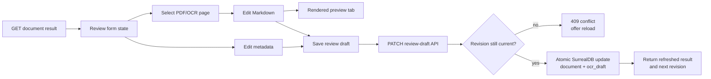

# Knowledge review editor implementation plan

## Goal

Turn the completed OCR screen into a reliable human-review workspace where a
reviewer can:

1. See the original PDF beside the OCR output.
2. Correct detected document metadata.
3. Correct each page's OCR Markdown without changing the immutable raw OCR.
4. Switch between editing the Markdown source and viewing a rendered preview.
5. Save all review-draft changes safely and resume them after a reload.

This plan does not confirm the draft, index the document, or publish reviewed
content. Those are separate workflow stages.

## Confirmed current-state findings

### Source PDF failure

The source endpoint is healthy:

- Full response: `200` with `Content-Type: application/pdf`.
- Range response: `206` with valid `Content-Range` and `Accept-Ranges`.
- The current PDF is 1,160,213 bytes and can be opened directly.

The production frontend image contains the PDF.js worker, but Nginx serves its
`.mjs` file as `application/octet-stream`. A module worker must be served with a
JavaScript MIME type. Chrome therefore rejects the worker and `react-pdf`
displays `Unable to render the source PDF.`

### Editing gaps

- `MetadataPanel.tsx` renders metadata with `<dl>` and has no form controls.
- `PdfComparisonWorkspace.tsx` renders OCR text in a read-only `<pre>`.
- The database already has `ocr_draft.pages.*.reviewed_text`, but there is no
  API operation that writes reviewer changes.
- The result response has no concurrency token, so a safe review-save operation
  must add one.

## Target review flow



## API contract

### Extend the result response

Keep `GET /v1/documents/{document_id}/result`, and add the draft revision to
the existing OCR draft object:

```json
{
  "document_id": "document:doc_...",
  "metadata": {},
  "ocr_draft": {
    "id": "ocr_draft:ocr_job_...",
    "status": "draft",
    "revision": 1,
    "pages": []
  }
}
```

`revision` is the optimistic-concurrency token for the complete human-review
draft, including metadata and reviewed page text.

### Add a review-draft write endpoint

Add:

```text
PATCH /v1/documents/{document_id}/review-draft
```

Request:

```json
{
  "expected_revision": 1,
  "metadata": {
    "title": "Corrected title",
    "document_type": "regulation",
    "document_number": "274/2006/QD-TTg",
    "description": null,
    "cohort": {
      "from_year": 2023,
      "to_year": null
    },
    "program_scope": {
      "type": "all",
      "programs": []
    },
    "language": "vi"
  },
  "pages": [
    {
      "page": 1,
      "reviewed_text": "# Corrected Markdown"
    }
  ]
}
```

The request sends the complete metadata form and only the OCR pages changed by
the reviewer. An empty `reviewed_text` is valid because a reviewer may
intentionally remove all OCR text from a page. Missing metadata values are
normalized to `null`; missing page entries remain unchanged.

On success, return `200` with the same full `DocumentResultResponse` shape used
by the GET endpoint, including the incremented `ocr_draft.revision`. This gives
the frontend one authoritative response with which to reset its form.

Error behavior:

| Status | Meaning |
| --- | --- |
| `404` | Document or its OCR draft does not exist. |
| `409` | Document is not in review, draft is no longer editable, or `expected_revision` is stale. |
| `422` | Metadata is invalid, page numbers are duplicated/unknown, or input limits are exceeded. |
| `503` | The review draft could not be persisted. |

Do not accept `raw_text`, `status`, `process_status`, document IDs, or draft IDs
in the patch body. Those fields are server-owned.

## Persistence and domain changes

### SurrealDB schema

In `knowledge/db/schema.surql`:

- Add `ocr_draft.revision` as an integer with default `1` and an assertion that
  it is at least `1`.
- Backfill existing drafts whose revision is absent before relying on it.
- Keep `raw_text` unchanged and keep the draft status as `draft` during saves.

### Domain validation

Reuse the existing `Cohort`, `ProgramScope`, and enum validation from
`knowledge/src/app/domain/document.py`. Add review-update models that enforce:

- Required non-blank title if a title is supplied.
- Language length constraints already used by `DocumentRecord`.
- `cohort.to_year >= cohort.from_year`.
- `specific_programs` requires at least one program; other scope types require
  an empty program list.
- Unique positive page numbers.
- A documented maximum length for each metadata string and each reviewed page
  so the endpoint cannot receive unbounded text.

### Atomic save

Add a focused database method such as `update_document_review(...)` in
`knowledge/src/app/infrastructure/surreal.py`.

The method must:

1. Resolve the draft belonging to the URL's document; do not trust a client
   draft ID.
2. Verify the document is in `review`, the draft is `draft`, and its revision
   equals `expected_revision`.
3. Merge changed `reviewed_text` values by page number while preserving every
   page's `raw_text`.
4. Update document metadata and the OCR draft in one transaction.
5. Increment the draft revision exactly once.
6. Return a distinct conflict result when the guarded revision check fails.
7. Roll back both records if either update fails.

The API should map the database result to the statuses listed above, then read
and return the refreshed review result.

## Frontend design

### Shared review state

Create a parent review component, for example
`DocumentReviewWorkspace.tsx`, and render it from `IngestionPage.tsx` once the
result is available. This parent owns:

- Editable metadata values.
- Editable OCR text keyed by page number.
- Current page and current OCR tab.
- Dirty state for metadata and individual pages.
- Save state: idle, saving, saved, error, or conflict.
- The current server revision.

This avoids separate metadata and OCR components saving incompatible snapshots.

When navigating between pages, retain unsaved edits in the page-keyed state.
When a new result arrives after saving, reset the baseline and clear dirty
flags. Warn before browser navigation/reload while unsaved changes exist.

### Editable metadata

Replace the read-only `MetadataPanel` presentation with a proper form:

| Metadata | Control |
| --- | --- |
| Title | Text input |
| Document type | Text input initially; do not invent a closed taxonomy |
| Document number | Text input |
| Language | Text input with validation hint |
| Description | Textarea |
| Cohort | From-year and optional to-year numeric inputs |
| Programme scope | Scope-type select plus programme list when `specific_programs` is selected |

Pre-fill every control with the detected value. Label the section “Detected
metadata — review and correct” so users understand these are suggestions, not
trusted final values. Put field-level validation next to the responsible input.

### Editable OCR Markdown

Keep the source PDF on the left. On the right, add accessible tabs:

- **Edit Markdown**: a large textarea whose initial value is
  `reviewed_text ?? raw_text`.
- **Preview**: renders the current textarea value, including unsaved edits.

Use `react-markdown` with `remark-gfm` for headings, lists, emphasis, links,
tables, and line breaks. Because existing OCR output contains `$...$`, also use
`remark-math`, `rehype-katex`, and KaTeX CSS for math rendering.

Security requirements:

- Do not enable raw HTML rendering and do not add `rehype-raw`.
- Allow the Markdown renderer to escape embedded HTML.
- Restrict links to safe protocols and open external links with safe `rel`
  attributes.
- Render preview content as React nodes; never use `dangerouslySetInnerHTML`.

Use real tab semantics (`role="tablist"`, `role="tab"`, `role="tabpanel"`),
keyboard navigation, visible focus, and selected state. Add responsive styles
so PDF and editor stack on narrow screens without losing the page controls.

### Saving

Add one primary **Save review draft** button for metadata and OCR edits.

- Disable it when nothing is dirty or while a save is running.
- Show `Saving…`, then a non-intrusive saved confirmation.
- Keep local edits intact if the request fails.
- For `409`, explain that another save changed the draft and offer a **Reload
  latest version** action. Do not silently overwrite.
- After success, replace local data with the returned result and revision.

Do not automatically change the draft to `confirmed`; saving and confirming
are different user intentions.

## Source PDF repair

Update `apps/admin-web/nginx.conf` so built `.mjs` assets, including the hashed
PDF.js worker, are served as JavaScript. Use a generic `.mjs` asset location or
equivalent MIME configuration that preserves the existing MIME types for CSS,
HTML, and other assets.

Required production checks:

```text
GET /assets/pdf.worker.min-<hash>.mjs
  -> 200
  -> Content-Type: application/javascript or text/javascript

GET /v1/documents/{document_id}/source with Range: bytes=0-1023
  -> 206
  -> Content-Type: application/pdf
  -> valid Content-Range
```

Keep the direct “Open original PDF” link as a fallback. Improve the inline
error to include a retry button and the direct-open action, while logging the
actual `react-pdf` load error for diagnosis without exposing sensitive data.

## File-level implementation map

### Backend

- `knowledge/db/schema.surql`
  - Add and backfill the draft revision field.
- `knowledge/src/app/domain/document.py`
  - Add bounded review-update models and reuse metadata invariants.
- `knowledge/src/app/api/v1/schemas/documents.py`
  - Add patch request models and expose `ocr_draft.revision`.
- `knowledge/src/app/api/v1/documents.py`
  - Add the review-draft PATCH route and error mapping.
- `knowledge/src/app/infrastructure/surreal.py`
  - Implement guarded atomic document/draft persistence.
- `knowledge/tests/api/test_document_review.py`
  - Cover the HTTP contract, validation, conflicts, and response shape.
- `knowledge/tests/infrastructure/test_document_results.py` or a new focused
  review-update test file
  - Cover typed record ownership, revision guarding, page merging, raw-text
    preservation, and transaction rollback.
- `knowledge/tests/infrastructure/test_schema.py`
  - Assert the revision schema/backfill is present.

### Frontend

- `apps/admin-web/nginx.conf`
  - Serve `.mjs` worker assets with a JavaScript MIME type.
- `apps/admin-web/package.json`
  - Add Markdown, GFM, math, and sanitized preview dependencies.
- `apps/admin-web/src/features/knowledge/api/contracts.ts`
  - Add revision and patch request/response schemas.
- `apps/admin-web/src/features/knowledge/api/knowledgeClient.ts`
  - Add `saveDocumentReviewDraft`.
- `apps/admin-web/src/features/knowledge/pages/IngestionPage.tsx`
  - Mount the shared review workspace.
- `apps/admin-web/src/features/knowledge/components/DocumentReviewWorkspace.tsx`
  - Own form state, dirty tracking, save lifecycle, and conflict handling.
- `apps/admin-web/src/features/knowledge/components/MetadataPanel.tsx`
  - Convert the display into controlled, accessible metadata fields, or replace
    it with a clearly named `MetadataEditor.tsx`.
- `apps/admin-web/src/features/knowledge/components/PdfComparisonWorkspace.tsx`
  - Accept shared page/editor state, retain PDF controls, and expose PDF retry.
- `apps/admin-web/src/features/knowledge/components/OcrMarkdownEditor.tsx`
  - Implement Edit Markdown and Preview tabs.
- `apps/admin-web/src/styles/global.css`
  - Style fields, errors, tabs, editor, preview typography, tables, math, dirty
    state, save feedback, and responsive layout.

## Test plan

### Backend automated tests

1. GET returns revision and existing reviewed text.
2. PATCH saves valid metadata and one or more changed pages.
3. PATCH leaves omitted pages untouched and preserves every `raw_text`.
4. PATCH accepts an intentionally empty reviewed page.
5. Invalid cohort and programme scope return `422`.
6. Duplicate or nonexistent page numbers return `422`.
7. Stale revision, non-review document, and confirmed draft return `409`.
8. Missing document/draft returns `404`.
9. A failed transaction changes neither metadata nor reviewed text.
10. Successful save increments revision once and returns the refreshed result.

### Frontend component/API tests

1. Detected metadata pre-fills editable controls.
2. Editing metadata and OCR text marks the workspace dirty.
3. Page changes preserve unsaved per-page edits.
4. Preview renders headings, GFM lists/tables, and math from the current unsaved
   editor text.
5. Embedded HTML is displayed safely and cannot execute.
6. Save sends normalized metadata, changed pages, and the expected revision.
7. Successful save clears dirty state and adopts the returned revision.
8. Failed save retains edits; `409` shows the reload-latest action.
9. Tabs have correct accessibility roles and keyboard behavior.

### Production-image integration check

Run the built frontend through its Nginx container, not only the Vite dev
server. A headless-browser test must:

1. Open a completed ingestion review page.
2. Assert the PDF.js worker response has a JavaScript MIME type.
3. Assert a PDF page canvas appears and the “Unable to render” message does
   not.
4. Edit metadata and page Markdown, preview it, save it, reload the page, and
   assert both edits persist.

This browser check is the regression boundary for the exact production-only
PDF failure.

## Implementation order

1. Add failing backend contract/infrastructure tests for review saving and
   revision conflicts.
2. Add the schema revision, domain request models, transactional database
   method, and PATCH endpoint; make backend tests pass.
3. Add failing production checks for the PDF worker MIME type and inline PDF
   canvas; fix Nginx and verify the checks pass.
4. Add frontend contracts and the save client with tests.
5. Build shared review state and the editable metadata form.
6. Build the page-keyed OCR editor and Markdown preview tabs.
7. Add save, dirty-navigation, error, and conflict UX.
8. Run backend tests, frontend unit tests, lint, typecheck, production build,
   Docker image checks, and the browser-level review flow.
9. Update `PDF_UPLOAD_TO_OUTPUT_FLOW.md` with the human-review save branch and
   the new endpoint after behavior is verified.

## Acceptance criteria

- The source PDF renders inline in the production Nginx container for the
  existing completed job; the direct-open fallback also remains available.
- Every displayed metadata field is user-editable and persists after reload.
- Each OCR page is user-editable; edits survive page navigation, save, and
  reload while `raw_text` remains unchanged.
- The OCR pane has accessible Edit Markdown and Preview tabs, and Preview
  renders the current unsaved Markdown safely.
- One save operation persists metadata and changed OCR pages atomically.
- Stale reviewers receive a visible conflict instead of silently overwriting
  newer changes.
- All backend, frontend, production-build, and browser regression checks pass.

