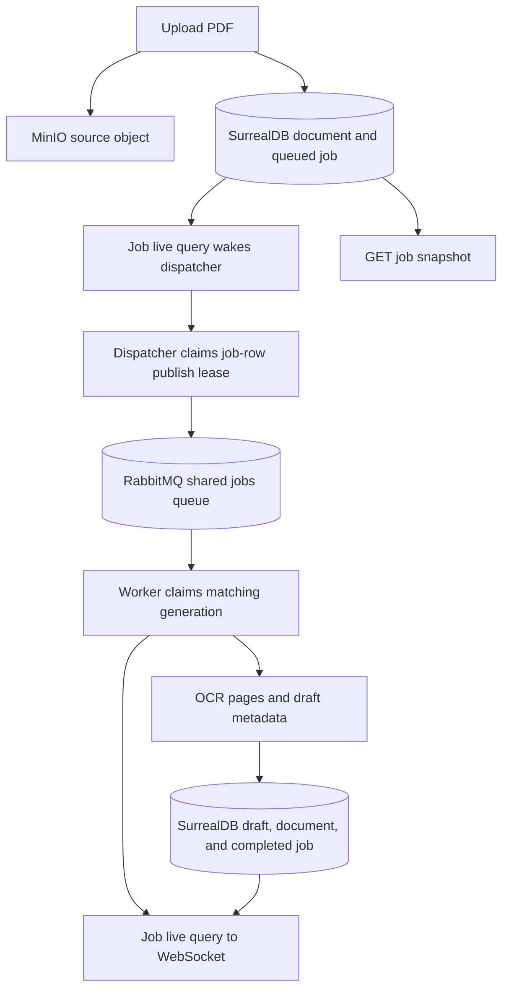

# PDF upload to OCR output

`POST /v1/documents` validates and stores the PDF, then commits the document
and queued job in one SurrealDB transaction. It returns `202` after that commit;
the API has no RabbitMQ publish step. A crash after commit leaves a queued job
for the dispatcher to find.

The dispatcher uses a SurrealDB live query for prompt wake-ups. It also scans
on startup, after reconnects, and at a bounded interval because notifications
can be missed. A queued job is published only if its current generation has no
confirmed publish, its retry times are due, and no dispatch lease is active.
It waits for RabbitMQ publisher confirmation before marking the generation
published. If confirmation is uncertain, a later duplicate trigger is safe:
the worker may claim that generation only once.

The worker reads `job.type` from the claimed database row, fetches the PDF from
MinIO, records OCR progress, saves an OCR draft, and moves the document to
`review`. A retry or recovered worker lease increments the job's dispatch
generation and makes a new trigger eligible.

`GET /v1/jobs/{job_id}` returns the authoritative progress snapshot. The API
subscribes to database job changes and sends sequenced WebSocket updates to
`/v1/ws/jobs/{job_id}`. When the WebSocket is unavailable, the browser polls
REST every three seconds and ignores stale sequence numbers.

See [KNOWLEDGE_WORKFLOW.md](KNOWLEDGE_WORKFLOW.md) for dispatch recovery and
cutover details.
