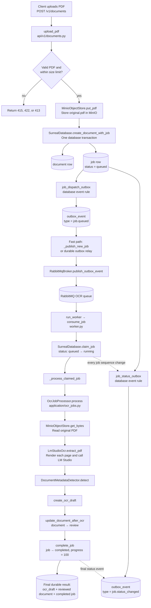

# PDF upload to OCR output flow

This guide follows one PDF from `POST /v1/documents` to its durable OCR
output. The final output is **not** a new PDF file: it is an `ocr_draft` row
containing per-page OCR text, plus a `document` row moved to `review` with
detected metadata. The completed `job` points to the `ocr_draft`.

## Main flow



## 1. The API receives and stores the PDF

**Entry function:** `upload_pdf` in
[`knowledge/src/app/api/v1/documents.py`](../knowledge/src/app/api/v1/documents.py)

```python
@router.post("", status_code=status.HTTP_202_ACCEPTED)
async def upload_pdf(file, database, object_store, settings):
    signature = await file.read(5)
    # validate %PDF-, empty file, and maximum upload size

    await object_store.put_pdf(object_key, BytesIO(pdf_data), size)
    await database.create_document_with_job(
        record_id, document, job_record_id, job_type="ocr"
    )
    await _publish_new_job(database, settings, job_record_id)
```

What it does:

1. Checks the file starts with `%PDF-`, is not empty, and does not exceed the
   configured upload limit.
2. Stores the original input at
   `documents/<document-id>/original.pdf` in MinIO.
3. Creates a `document` row and an OCR `job` row in one SurrealDB transaction.
4. Returns `202 Accepted` with `document_id` and `job_id`. `202` means OCR
   continues in the background; it does not mean that OCR is already complete.

## 2. Creating the job creates outbox rows

**Database write:** `SurrealDatabase.create_document_with_job` in
[`knowledge/src/app/infrastructure/surreal.py`](../knowledge/src/app/infrastructure/surreal.py)

The new job starts like this:

```text
type = ocr
status = queued
step = queued
progress = 0
sequence = 1
dispatch_generation = 1
```

SurrealDB then automatically runs two **database event rules**, defined in
[`knowledge/db/schema.surql`](../knowledge/db/schema.surql):

| Database event rule | It creates this normal `outbox_event` table row | Purpose |
| --- | --- | --- |
| `job_dispatch_outbox` | `type = "job.queued"` | Tell a worker that the job can start. |
| `job_status_outbox` | `type = "job.status_changed"` | Tell API/WebSocket consumers that job state changed. |

An outbox row is only durable database data. For example:

```json
{
  "type": "job.queued",
  "job_id": "job:job_123",
  "dispatch_generation": 1,
  "published_at": null
}
```

`published_at: null` means this instruction has not yet been confirmed by
RabbitMQ.

## 3. The outbox sends `job.queued` to RabbitMQ

**Fast path:** `_publish_new_job` in
[`knowledge/src/app/api/v1/documents.py`](../knowledge/src/app/api/v1/documents.py).

The API tries to publish the just-created dispatch event immediately. This
reduces latency but is optional: an unsuccessful attempt does not lose the
job because the outbox row remains in SurrealDB.

**Reliable fallback:** `run_outbox_publisher` in
[`knowledge/src/app/outbox.py`](../knowledge/src/app/outbox.py).

The relay opens a SurrealDB live subscription to `outbox_event`. A change
notification wakes it; it then reads the authoritative pending rows with
`_drain_pending_events`. It does not issue a fixed one-second polling query
while idle.

For every pending row, this core path runs:

```python
await broker.publish_outbox_event(event)
await database.mark_outbox_published(event_id)
```

`RabbitMqBroker.publish_outbox_event`, in
[`knowledge/src/app/infrastructure/rabbitmq.py`](../knowledge/src/app/infrastructure/rabbitmq.py),
uses the row's `type` to select the destination:

```text
job.queued         → knowledge.jobs direct exchange → OCR queue
job.status_changed → knowledge.status topic exchange → status subscribers
```

It waits for RabbitMQ publisher confirmation before setting `published_at`.
If confirmation fails or is unknown, the row stays pending and the relay
retries later. Therefore the system uses **at-least-once delivery**; duplicate
`job.queued` messages are expected to be safe.

## 4. A worker claims the queued job

**Worker entry:** `run_worker` in
[`knowledge/src/app/worker.py`](../knowledge/src/app/worker.py).

`RabbitMqBroker.consume_jobs` delivers the small queue message to the nested
`consume_job` function. It calls:

```python
job = await database.claim_job(
    record_id, settings.worker_id, settings.worker_lease_seconds
)
```

`SurrealDatabase.claim_job` makes a guarded update:

```text
only if job.status = queued and its retry time is due
  status            = running
  step              = claimed
  worker_id         = this worker
  lease_expires_at  = now + worker lease duration
  attempts         += 1
  sequence         += 1
```

Only after that durable claim succeeds does the worker ACK the RabbitMQ
message. A repeated delivery cannot make another worker process the same
already-running job, because its guarded claim returns no job.

`_maintain_lease` runs beside OCR and renews the lease every
`KNOWLEDGE_WORKER_HEARTBEAT_SECONDS` (30 seconds by default). If a worker
crashes and its lease expires, `requeue_expired_jobs` moves it back to
`queued`; that creates another `job.queued` outbox row for recovery.

## 5. OCR produces pages, metadata, and a draft

**Orchestrator:** `_process_claimed_job` in `worker.py` calls
`OcrJobProcessor.process` in
[`knowledge/src/app/application/ocr_jobs.py`](../knowledge/src/app/application/ocr_jobs.py).

The processor:

1. Calls `get_document` and `MinioObjectStore.get_bytes` to retrieve the
   original PDF.
2. Updates the owned job to `step = "ocr"`, `progress = 10`.
3. Calls `LmStudioOcr.extract_pdf` in
   [`knowledge/src/app/infrastructure/ocr.py`](../knowledge/src/app/infrastructure/ocr.py).
4. `extract_pdf` counts pages, renders one page at a time as PNG, sends each
   image to LM Studio's OpenAI-compatible `/chat/completions` endpoint, and
   returns `OcrPage` values in page order.
5. Saves progress after each page. Each update increments the job `sequence`,
   which creates a `job.status_changed` outbox row for clients.
6. Calls `DocumentMetadataDetector.detect` to make first-pass metadata from
   the OCR text and original filename.
7. Calls `create_ocr_draft` to store the page text under a stable draft ID.
8. Calls `update_document_after_ocr`, setting `document.process_status` to
   `review` and saving the detected metadata.
9. Calls `complete_job`, setting the job to `completed`, progress to `100`,
   and attaching `ocr_draft_id`.

The key completion calls are:

```python
await database.create_ocr_draft(ocr_draft_id, document_id, pages)
await database.update_document_after_ocr(document_id, len(pages), metadata)
await database.complete_job(job_id, ocr_draft_id, len(pages), worker_id)
```

## Final state to read

Use `GET /v1/jobs/{job_id}` (implemented by `get_job_status` in
[`knowledge/src/app/api/v1/jobs.py`](../knowledge/src/app/api/v1/jobs.py)) as
the authoritative completion check.

Successful result:

```text
job.status          = completed
job.progress        = 100
job.ocr_draft_id    = ocr_draft:ocr_<job-id>

document.process_status = review
ocr_draft.pages          = [{ page: 1, raw_text: "..." }, ...]
```

The original PDF remains in MinIO. The OCR draft and document metadata remain
in SurrealDB for the human-review stage.

## Human review draft branch

Once the OCR job completes, the document is in `review` and the OCR draft is
still `draft`. A reviewer reads the source PDF and corrects detected metadata
and page text through:

```text
PATCH /v1/documents/{document_id}/review-draft
```

The request includes the last-read OCR-draft revision, the complete metadata
form, and only OCR pages whose Markdown changed. The service updates the
`document` metadata and `ocr_draft.pages[].reviewed_text` in one transaction,
then increments the draft revision. `raw_text` is preserved as the original OCR
evidence. A stale revision returns `409 Conflict` so a second reviewer cannot
silently overwrite a newer save.

## Failure and retry branch

If OCR fails, `_handle_job_failure` in `worker.py` calls
`schedule_retry_or_fail`:

```text
retryable failure with attempts remaining
  → job returns to queued with next_attempt_at
  → job_dispatch_outbox creates delayed job.queued outbox row
  → relay publishes it when the retry time arrives

permanent failure or no attempts remaining
  → job becomes failed
  → document.process_status becomes failed
```
