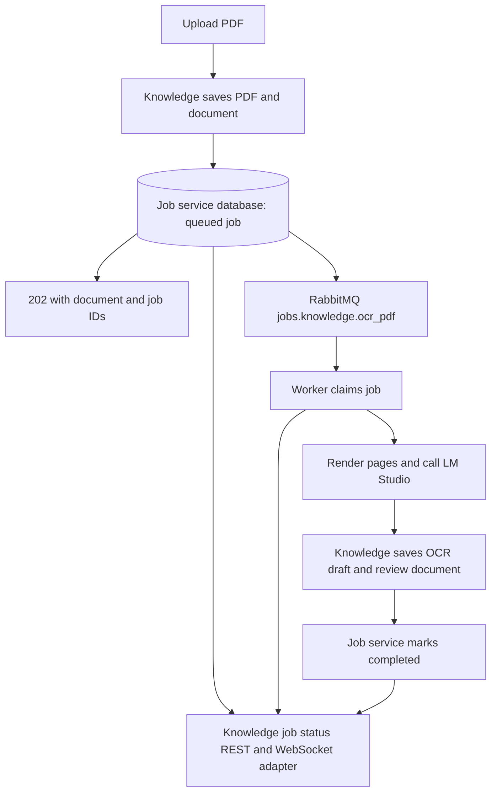

# PDF upload to OCR output

```mermaid
flowchart TD
  U[Upload PDF] --> K[Knowledge saves PDF and document]
  K --> J[(Job service database: queued job)]
  J --> A[202 with document and job IDs]
  J --> R[RabbitMQ jobs.knowledge.ocr_pdf]
  R --> W[Worker claims job]
  W --> O[Render pages and call LM Studio]
  O --> D[Knowledge saves OCR draft and review document]
  D --> C[Job service marks completed]
  J --> S[Knowledge job status REST and WebSocket adapter]
  W --> S
  C --> S
```

The document and job are in separate databases. Knowledge uses a stable creation key to make a repeated central job creation safe. Job service publishes after creation and replays queued jobs on startup or broker reconnect. Duplicate triggers cannot claim a job twice. The worker uses authenticated Knowledge callbacks for source and result, so it does not need MinIO or Knowledge database credentials.

A caught OCR error marks the document and job failed. A page request exceeding 60 seconds is a caught timeout. A worker process death after claim may leave the job running; there is no lease or periodic recovery scan.

See [workflow](KNOWLEDGE_WORKFLOW.md) and [presentation guide](UPLOAD_TO_OCR_PRESENTATION_GUIDE.md).
