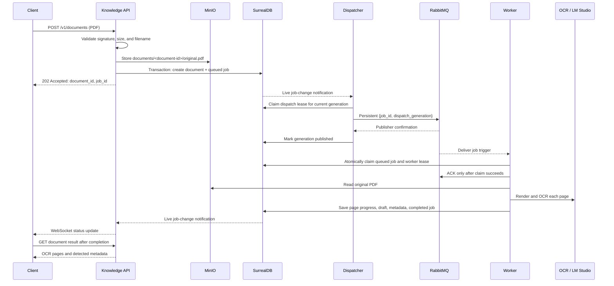

# Presenting the document upload to OCR-result workflow

This guide is a study and presentation script for the knowledge-service flow
from uploading a PDF to reading its final OCR result. It describes the code
that exists in this repository.

## The short explanation

The API stores the source PDF in MinIO, then creates a `document` and a queued
`job` together in SurrealDB. It returns `202 Accepted` because OCR runs in the
background. A dispatcher notices the durable job row and sends a small,
confirmed message to RabbitMQ. A worker claims that job, reads the PDF from
MinIO, performs OCR page by page, saves an OCR draft and detected metadata,
and marks the job complete. The client reads live progress through a WebSocket
or polls the job endpoint; it reads the final OCR output from the document
result endpoint.

The central design decision is: **SurrealDB owns the truth about a job;
RabbitMQ only delivers a trigger to start work.**

## What the client calls

| Purpose | Endpoint | Successful response |
| --- | --- | --- |
| Start ingestion | `POST /v1/documents` with multipart field `file` | `202 Accepted`, document and job IDs |
| Read progress | `GET /v1/jobs/{job_id}` | Current durable job snapshot |
| Receive live progress | `WS /v1/ws/jobs/{job_id}` | Initial snapshot, then sequenced updates |
| Read final OCR output | `GET /v1/documents/{document_id}/result` | `200 OK` when OCR has reached review state |
| View original PDF | `GET /v1/documents/{document_id}/source` | Streamed PDF, including byte-range support |

The route prefix `/v1` is registered in
[router.py](../knowledge/src/app/api/v1/router.py). The actual upload route is
therefore `POST /v1/documents`, even though its decorator in
[`documents.py`](../knowledge/src/app/api/v1/documents.py) only shows `POST /`.

## Immediate response versus final response

Do not describe the upload response as the final OCR output. They are two
different responses.

```text
POST /v1/documents
    -> 202 Accepted immediately after the document and queued job commit

GET /v1/jobs/{job_id}
    -> progress while OCR is queued or running

GET /v1/documents/{document_id}/result
    -> 409 while the OCR result is not ready
    -> 200 with OCR pages and metadata after the job completes
```

An example upload response is:

```json
{
  "document_id": "document:doc_<uuid>",
  "job_id": "job:job_<uuid>",
  "status": "processing"
}
```

The response model is `DocumentUploadAcceptedResponse` in
[`schemas/documents.py`](../knowledge/src/app/api/v1/schemas/documents.py).

## Complete flow



## Step 1: API receives and validates the PDF

Start reading at `upload_pdf` in
[`api/v1/documents.py`](../knowledge/src/app/api/v1/documents.py).

The function receives FastAPI's `UploadFile` and three injected dependencies:

| Dependency | Why it is needed |
| --- | --- |
| `SurrealDatabase` | Creates the durable document and job rows. |
| `MinioObjectStore` | Stores the original PDF bytes. |
| `Settings` | Supplies the maximum upload size. |

The validation logic is intentionally simple and easy to explain:

1. It reads the first five bytes and requires `%PDF-`. A different signature
   returns `415 Unsupported Media Type`.
2. It reads the complete file and rejects an empty file with `422
   Unprocessable Entity`.
3. It compares the byte count with `settings.max_upload_bytes`; an oversized
   file returns `413 Payload Too Large`.
4. It uses `Path(...).name` to keep only the filename, not a client-supplied
   directory path.

The API generates its own random IDs. Clients cannot choose a document ID or
job ID:

```text
document:doc_<uuid>
job:job_<uuid>
documents/doc_<uuid>/original.pdf
```

## Step 2: Store the source, then commit the durable work request

The API first calls `MinioObjectStore.put_pdf`. Its implementation is in
[`infrastructure/minio.py`](../knowledge/src/app/infrastructure/minio.py) and
stores the object with content type `application/pdf` in the configured private
bucket.

It then calls `create_document_with_job` in
[`infrastructure/surreal.py`](../knowledge/src/app/infrastructure/surreal.py).
That database method creates both rows in one SurrealDB transaction:

```text
document
  source.object_key = documents/<document-id>/original.pdf
  process_status    = processing
  status            = active

job
  type                = ocr
  document_id         = document:<document-id>
  status              = queued
  step                = queued
  progress            = 0
  sequence            = 1
  dispatch_generation = 1
```

Creating the `document` and `job` together matters. The API does not return a
job ID until the database has durably committed both records.

### Important limitation to explain honestly

MinIO and SurrealDB do not share a distributed transaction. The PDF is stored
first, then the database transaction runs. If MinIO succeeds but SurrealDB
fails, an unused source object can remain. The service intentionally does not
delete it immediately after an ambiguous database failure because the database
commit may actually have succeeded before the connection failed. The separate
orphan-cleanup process handles old unused objects conservatively.

## Step 3: Why the upload endpoint does not publish to RabbitMQ

After the database commit, `upload_pdf` returns `202`. It does **not** call
RabbitMQ directly.

That solves this failure case:

```text
API commits job in SurrealDB
API crashes before RabbitMQ publish
```

If the API published directly, that job could remain queued forever. In this
design, the committed job row itself is the durable request to dispatch work.
The dispatcher can find it after an API crash, a broker outage, or a missed
database notification.

## Step 4: Dispatcher turns a durable job into a broker message

Read [`dispatcher.py`](../knowledge/src/app/dispatcher.py) next.

The `knowledge-dispatcher` process has three wake-up mechanisms:

1. A SurrealDB live query on the `job` table for low-latency notification.
2. A startup scan, so jobs created before the dispatcher started are found.
3. A bounded reconciliation scan and timer, so a live-query disconnect or a
   future retry time cannot strand a job.

The live query is a wake-up hint, not the source of truth. On any wake-up the
dispatcher asks SurrealDB which jobs are currently eligible.

An eligible job is:

```text
status = queued
dispatch_published_at is empty
worker retry time is due
publisher retry time is due
no active dispatch lease
```

### Dispatch lease and generation

Two dispatcher instances may see the same job. Before publishing, each tries
to atomically claim a per-job dispatch lease. Only one claim succeeds.

| Field | Meaning |
| --- | --- |
| `dispatch_generation` | Version of the dispatch request. It increases when a job is retried or a worker lease expires. |
| `dispatch_lease_owner` | Unique token for one publisher attempt. |
| `dispatch_lease_expires_at` | Recovery point if that dispatcher crashes. |
| `dispatch_publish_attempts` | Count used for publisher retry backoff. |
| `dispatch_published_at` | Present only after RabbitMQ confirms delivery for this generation. |

The dispatcher publishes only this small JSON payload through
`RabbitMqBroker.publish_job_trigger` in
[`infrastructure/rabbitmq.py`](../knowledge/src/app/infrastructure/rabbitmq.py):

```json
{
  "job_id": "job:job_<uuid>",
  "dispatch_generation": 1
}
```

It uses a persistent message, the existing `knowledge.jobs.ocr` queue, routing
key `job.queued`, mandatory routing, and RabbitMQ publisher confirmation.

After confirmation, the dispatcher updates the same job row with
`dispatch_published_at`. Both success and failure updates are guarded by the
same generation and lease token. A late result from an older publisher cannot
overwrite newer dispatch state.

## Step 5: Worker claims the job before doing OCR

Read [`worker.py`](../knowledge/src/app/worker.py).

RabbitMQ delivery does not grant permission to process a job. The worker calls
`database.claim_job(job_id, worker_id, lease_seconds, dispatch_generation)`.
The guarded database update succeeds only when the row is still queued, the
generation matches, and any retry time is due.

On a successful claim, the job becomes:

```text
status            = running
step              = claimed
worker_id         = current worker
lease_expires_at  = now + worker lease duration
attempts         += 1
sequence         += 1
```

Only then does the worker ACK the RabbitMQ message. This is the most important
reliability boundary in the worker:

- Duplicate broker messages are safe because only one guarded claim succeeds.
- A stale message from an older generation is safe because the generation no
  longer matches.
- A worker crash before its claim means RabbitMQ can redeliver the message.
- A worker crash after its claim is recovered when its database lease expires.

The worker starts a lease-maintenance task while processing. It also periodically
calls `requeue_expired_jobs`. Recovery changes an abandoned running job back to
queued, increments `dispatch_generation`, clears dispatch fields, and lets the
dispatcher publish a new trigger.

## Step 6: OCR processor creates the final records

Read [`application/ocr_jobs.py`](../knowledge/src/app/application/ocr_jobs.py),
then [`infrastructure/ocr.py`](../knowledge/src/app/infrastructure/ocr.py).

`OcrJobProcessor.process` receives the already claimed job. It:

1. Loads the matching `document` record and source object key.
2. Reads the original PDF bytes from MinIO.
3. Renders the PDF and calls the configured LM Studio OCR model one page at a
   time.
4. Updates the owned job with page count and progress.
5. Runs `DocumentMetadataDetector` on OCR text and filename.
6. Writes an `ocr_draft` with a stable ID: `ocr_<job-id>`.
7. Updates the `document` with detected metadata and sets
   `process_status = review`.
8. Marks the job `completed`, `progress = 100`, and attaches `ocr_draft_id`.

The draft ID is stable so retries or a recovered delivery do not create several
independent drafts for one job.

The main records after success are:

```text
document.process_status = review
document.page_count     = number of PDF pages

ocr_draft.status        = draft
ocr_draft.pages         = [{ page, raw_text, reviewed_text }, ...]

job.status              = completed
job.step                = completed
job.progress            = 100
job.ocr_draft_id        = ocr_draft:ocr_<job-id>
```

The document reaches `review`, not a final published/indexed state. OCR text
and detected metadata are deliberately available for a human to check first.

## Step 7: How the client receives progress

The status read path begins in
[`api/v1/jobs.py`](../knowledge/src/app/api/v1/jobs.py).

`GET /v1/jobs/{job_id}` reads the job row and maps only public fields into
`JobStatusResponse`:

```json
{
  "id": "job:job_<uuid>",
  "type": "ocr",
  "status": "running",
  "step": "ocr",
  "progress": 50,
  "processed_pages": 2,
  "total_pages": 4,
  "sequence": 4
}
```

Each API instance also runs `run_job_status_subscription` from
[`job_status_subscription.py`](../knowledge/src/app/job_status_subscription.py).
It subscribes to SurrealDB job changes, reloads the authoritative job row, and
broadcasts a safe `JobStatusResponse` snapshot through `JobStatusHub`.

The WebSocket endpoint first sends `job.status_snapshot`, then later sends
`job.status_changed` messages. If the database live query disconnects, the API
closes active WebSockets so the browser falls back to REST polling rather than
believing that it is still live.

### Why `sequence` exists

`sequence` is the UI-visible version number of a job. It starts at `1` and
increases whenever progress, state, or another user-visible field changes.
The browser accepts only newer sequence numbers, so a delayed 25% message
cannot move a displayed 50% job backward.

Dispatcher bookkeeping does not increment `sequence`, because a user does not
need a new progress event merely because a RabbitMQ publish was confirmed.

## Step 8: Read the final OCR response

The final output endpoint is `get_document_result` in
[`api/v1/documents.py`](../knowledge/src/app/api/v1/documents.py).

It loads the document and OCR draft from SurrealDB. It returns:

| Condition | Response |
| --- | --- |
| Unknown or invalid document ID | `404 Not Found` |
| Database unavailable | `503 Service Unavailable` |
| OCR still processing, failed, or no draft exists | `409 Conflict` with `OCR result is not ready` |
| `document.process_status = review` and a draft exists | `200 OK` with document metadata and OCR pages |

The returned result intentionally includes a safe source summary, metadata,
and page text. It does not expose the internal MinIO object key.

```json
{
  "document_id": "document:doc_<uuid>",
  "process_status": "review",
  "source": {
    "original_filename": "handbook.pdf",
    "mime_type": "application/pdf"
  },
  "page_count": 4,
  "metadata": {
    "title": "...",
    "document_type": "..."
  },
  "ocr_draft": {
    "id": "ocr_draft:ocr_job_<uuid>",
    "status": "draft",
    "revision": 1,
    "pages": [
      { "page": 1, "raw_text": "...", "reviewed_text": null }
    ]
  }
}
```

## Failure and recovery story

| Failure | What remains true | Recovery |
| --- | --- | --- |
| API crashes after SurrealDB commit | Queued job row remains durable. | Dispatcher startup/reconciliation scan finds and publishes it. |
| RabbitMQ is down during upload | API can still commit document and job, then return `202`. | Dispatcher retries publishing when the broker reconnects. |
| Dispatcher crashes during publish | Job retains an unconfirmed dispatch state or an expiring lease. | Another dispatcher or a later scan takes over after lease expiry. Duplicate messages are safe. |
| RabbitMQ redelivers a message | The job row determines whether work may run. | Worker claim rejects a running, completed, stale, or wrong-generation job. |
| Worker crashes during OCR | Its worker lease eventually expires. | Recovery requeues the job with a new dispatch generation. |
| OCR call fails temporarily | Job records error and retry time if attempts remain. | Worker schedules bounded retry; dispatcher sends a new generation when due. |
| WebSocket/live query disconnects | Job row still has current state. | Client reads `GET /v1/jobs/{job_id}` and resumes from the latest sequence. |

The delivery guarantee is **at least once**, not exactly once. Duplicate broker
messages are expected in some failure windows. Atomic job claims, generations,
leases, and stable draft IDs make those duplicates safe.

## Data model to understand

Read [`db/schema.surql`](../knowledge/db/schema.surql).

| Table | Responsibility |
| --- | --- |
| `document` | Source metadata, detected metadata, review lifecycle, and source object reference. |
| `job` | Durable task state, progress, retry state, worker lease, and dispatch state. |
| `ocr_draft` | Page-level OCR text and later reviewer corrections. |
| `chunk` | Future retrieval/embedding storage; it is not produced by this OCR workflow yet. |

For the presentation, focus on `document`, `job`, and `ocr_draft`. Mention that
`chunk` is a prepared schema for the next retrieval stage, not part of the
upload-to-OCR result path.

## Recommended reading order

Read these files in this order and be able to describe each file in one
sentence.

1. [`api/v1/router.py`](../knowledge/src/app/api/v1/router.py) — proves the
   public route paths.
2. [`api/v1/documents.py`](../knowledge/src/app/api/v1/documents.py) — upload,
   result, source PDF, and reviewer endpoints.
3. [`api/v1/schemas/documents.py`](../knowledge/src/app/api/v1/schemas/documents.py)
   and [`schemas/jobs.py`](../knowledge/src/app/api/v1/schemas/jobs.py) — the
   exact API contracts.
4. [`infrastructure/minio.py`](../knowledge/src/app/infrastructure/minio.py)
   — source PDF storage and retrieval.
5. [`infrastructure/surreal.py`](../knowledge/src/app/infrastructure/surreal.py)
   — transactions, guarded claims, retries, and status persistence.
6. [`dispatcher.py`](../knowledge/src/app/dispatcher.py) — job-row to RabbitMQ
   delivery.
7. [`infrastructure/rabbitmq.py`](../knowledge/src/app/infrastructure/rabbitmq.py)
   — queue topology, publisher confirmation, and message validation.
8. [`worker.py`](../knowledge/src/app/worker.py) — admission, lease ownership,
   ACK boundary, and retry policy.
9. [`application/ocr_jobs.py`](../knowledge/src/app/application/ocr_jobs.py)
   and [`infrastructure/ocr.py`](../knowledge/src/app/infrastructure/ocr.py) —
   page processing and OCR provider call.
10. [`job_status_subscription.py`](../knowledge/src/app/job_status_subscription.py)
    and [`websocket_hub.py`](../knowledge/src/app/websocket_hub.py) — database
    changes to browser updates.
11. [`db/schema.surql`](../knowledge/db/schema.surql) — field constraints and
    the durable data model.

## A five-minute presentation script

1. “The client uploads a PDF to `POST /v1/documents`. The API validates the
   PDF signature and size.”
2. “The original PDF goes to MinIO. Then SurrealDB commits the document and
   queued OCR job together.”
3. “The API returns `202 Accepted`, not final text, because OCR is asynchronous.
   It returns the document ID and job ID for later requests.”
4. “A separate dispatcher observes the durable job row and publishes a
   confirmed RabbitMQ trigger. It can recover from missed notifications by
   scanning the job table.”
5. “The worker must atomically claim the job in SurrealDB before it ACKs
   RabbitMQ. This makes duplicate messages and multiple workers safe.”
6. “The OCR processor reads the stored PDF, processes pages, saves progress,
   creates an OCR draft, detects metadata, and changes the document to review.”
7. “The client reads progress through WebSocket or REST. `sequence` prevents
   delayed events from replacing newer progress.”
8. “Finally, `GET /v1/documents/{document_id}/result` returns the OCR draft and
   detected metadata once the document reaches review state.”

## Questions you should be ready to answer

### Why use both SurrealDB and RabbitMQ?

SurrealDB stores durable state and decides whether a job may run. RabbitMQ
delivers a lightweight wake-up message to workers. If RabbitMQ is temporarily
unavailable, the API can still accept uploads because the queued job is already
durable in SurrealDB.

### Why not publish to RabbitMQ directly in the upload endpoint?

The database commit and broker publish cannot be one transaction. A crash
between them could lose the only publish attempt. The dispatcher scans durable
job rows, so it can recover that case.

### Why return `202` instead of `200` from upload?

`202 Accepted` means the server accepted and durably queued work that will
finish later. A `200` with OCR content would incorrectly imply the processing
is complete.

### What prevents two workers from processing the same document?

The worker performs a guarded, atomic `claim_job` update. Only one worker can
change a queued job of the correct generation into a running job with its
lease. Other deliveries ACK without running OCR.

### What happens if the worker dies halfway through OCR?

Its lease expires. The recovery sweep requeues the job, increases its dispatch
generation, and the dispatcher publishes a new trigger. The stable OCR draft ID
also makes repeated completion writes safe.

### What is `sequence`?

It is the version of user-visible job progress. The client accepts only updates
with a higher sequence, preventing out-of-order WebSocket events from showing
older progress.

### Where is the final text stored?

In `ocr_draft.pages[].raw_text` in SurrealDB. The original binary PDF remains
in MinIO, while the `document` row stores its object key and metadata.

## Live demo checklist

1. Open the admin UI at `http://localhost:5173` or use an API client to upload
   a small PDF.
2. Copy the returned `document_id` and `job_id`.
3. Call `GET /v1/jobs/{job_id}` repeatedly. Show `queued`, `running`, page
   progress, and `completed` if the OCR model is available.
4. In Surrealist, run:

   ```sql
   USE NS hsu DB knowledge;
   SELECT id, status, step, progress, sequence, attempts FROM job;
   SELECT id, process_status, page_count FROM document;
   ```

5. When the job completes, call
   `GET /v1/documents/{document_id}/result` and show the OCR draft pages.
6. Explain that a `409 OCR result is not ready` before completion is expected,
   not an error in the endpoint.

## Scope boundary

This workflow ends when OCR output reaches the human-review state. Reviewers
can edit the draft through `PATCH /v1/documents/{document_id}/review-draft`.
Chunking, embeddings, and retrieval are represented in the schema but are not
yet part of the upload-to-final-OCR-result flow.
