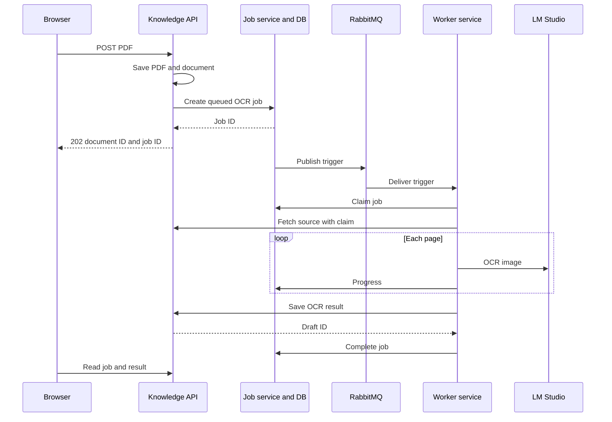

# Presenting upload to OCR result

This guide follows the current implementation from `POST /v1/documents` to the reviewable OCR draft. The job lifecycle is owned by job service in a separate database; Knowledge owns the PDF, document, and draft.

## One-minute explanation

Knowledge validates and stores a PDF in MinIO, creates its document row, and requests an idempotent queued OCR job from job service. It returns `202` with both IDs after the job row is durable. Job service publishes a RabbitMQ trigger. Worker service claims the job atomically, gets the PDF from a claim-checked Knowledge endpoint, runs OCR page by page through LM Studio, and reports progress. The worker sends text to Knowledge, which stores the OCR draft and moves the document to review. The worker then marks the central job completed. The UI follows status through Knowledge's existing REST and WebSocket routes.

## Public endpoints

| Purpose | Route | What to explain |
| --- | --- | --- |
| Upload PDF | `POST /v1/documents` | Multipart `file`; returns `202 {document_id, job_id}` |
| Read job | `GET /v1/jobs/{job_id}` | Snapshot mapped from central job service |
| Follow job | `WS /v1/ws/jobs/{job_id}` | Sequence-numbered snapshot and updates |
| Read OCR draft | `GET /v1/documents/{document_id}/result` | Draft, pages, metadata, document state |
| View original | `GET /v1/documents/{document_id}/source` | PDF stream for review |
| Edit review | `PATCH /v1/documents/{document_id}/review-draft` | Revision-checked reviewer changes |

The public router is in [router.py](../knowledge/src/app/api/v1/router.py). Read [documents.py](../knowledge/src/app/api/v1/documents.py) for upload, source, result, and review; read [jobs.py](../knowledge/src/app/api/v1/jobs.py) for the compatibility status routes.

## Source code in execution order

1. **Upload validation:** `upload_pdf` in [documents.py](../knowledge/src/app/api/v1/documents.py) checks the PDF signature and size, generates a document ID, and saves the bytes using [minio.py](../knowledge/src/app/infrastructure/minio.py).
2. **Knowledge document:** `SurrealDatabase.create_document` in [surreal.py](../knowledge/src/app/infrastructure/surreal.py) saves the source object key and `process_status=processing`. Knowledge's [schema](../knowledge/db/schema.surql) defines `document` and `ocr_draft`, not `job`.
3. **Central job creation:** [job_service.py](../knowledge/src/app/infrastructure/job_service.py) calls `POST /internal/v1/jobs` with `owner=knowledge`, `type=ocr_pdf`, `subject_id=document_id`, and a stable creation key. The owner bearer token restricts which service can create that job.
4. **Central database:** [job service main.py](../../job-service/src/job_service/main.py) authenticates and validates the request. [store.py](../../job-service/src/job_service/store.py) creates the row in the dedicated [job schema](../../job-service/db/schema.surql). The unique `(owner, creation_key)` index makes a repeated creation safe.
5. **Publish:** [publisher.py](../../job-service/src/job_service/publisher.py) sends a persistent envelope to the durable `jobs.knowledge.ocr_pdf` queue after the job is stored. It scans queued jobs once on the first broker connection and after a reconnect. There is no periodic scan or publisher confirmation.
6. **Consume and claim:** [worker main.py](../../worker-service/src/worker_service/main.py) declares a consumer channel with prefetch one. [core.py](../../worker-service/src/worker_service/core.py) validates the exact `(owner,type,version)` envelope and asks job service to change `queued -> running` with a random claim ID. It ACKs after the claim. A duplicate trigger cannot win another claim.
7. **OCR:** [ocr.py](../../worker-service/src/worker_service/ocr.py) fetches the PDF from Knowledge, renders its pages, calls LM Studio `/chat/completions`, and posts page count and progress to job service. Each LM Studio request has a 60-second elapsed deadline; that is per page, not per document.
8. **Knowledge callbacks:** [internal_jobs.py](../knowledge/src/app/api/internal_jobs.py) authenticates the worker and asks job service to verify the active claim and subject document. It releases source bytes, accepts ordered text pages, or marks a caught failure. Knowledge's `apply_ocr_result` writes the draft and document review state. Repeating the same result returns the existing draft and does not overwrite reviewer edits.
9. **Complete:** Worker service calls the central `complete` endpoint only after Knowledge confirms its result is stored. The job stores an opaque draft reference. [jobs.py](../knowledge/src/app/api/v1/jobs.py) translates central snapshots and events into the response expected by the existing UI.

## What to understand about the data

| Data | Owner | Why |
| --- | --- | --- |
| Original PDF | Knowledge MinIO bucket | Knowledge manages source files and access |
| `document`, `ocr_draft` | Knowledge SurrealDB | Domain state and reviewer edits |
| `job` | Dedicated job-service SurrealDB | Generic lifecycle for all originating services |
| Message | RabbitMQ | Trigger only; database remains authoritative |
| OCR model output | Knowledge draft | Reviewable text, not a RabbitMQ payload |

A central job has `owner`, `type`, opaque `subject_id`, `status`, `step`, `progress`, `sequence`, optional page counts, `claim_id`, result reference, error, and timestamps. It has no Knowledge-specific `document_id` or `ocr_draft_id` columns. The public Knowledge adapter maps those generic values to the old UI shape.

## State and failure questions

- **Why return 202 before OCR?** OCR can take time. The endpoint waits for durable document and job writes, then responds; it does not wait for the worker or RabbitMQ confirmation.
- **Why two databases?** Job service owns shared lifecycle state; Knowledge owns domain data. These writes cannot share one transaction, so creation keys and write ordering matter.
- **Broker down when uploading?** The job remains queued in the central database. Job service republishes queued jobs when it establishes or re-establishes a broker connection.
- **Duplicate message?** The `queued -> running` claim is guarded in the central database. Only one worker wins.
- **OCR timeout or caught exception?** The worker marks the Knowledge document and central job failed; no OCR retry is scheduled.
- **Worker dies after claim and ACK?** Its catch block cannot run. The central job may stay running. This design has no worker lease or automatic worker-death recovery.
- **Result stored, completion call fails?** The worker retries temporary failures while alive. If it dies, a draft can exist while the job remains running.
- **Knowledge dies before central job creation?** An old processing document without a central creation key can be detected by orphan cleanup after a grace period.
- **Why sequence numbers?** UI clients can ignore older updates after a WebSocket reconnect and fetch the REST snapshot.

## A short diagram

```mermaid
sequenceDiagram
  participant B as Browser
  participant K as Knowledge API
  participant J as Job service and DB
  participant R as RabbitMQ
  participant W as Worker service
  participant L as LM Studio
  B->>K: POST PDF
  K->>K: Save PDF and document
  K->>J: Create queued OCR job
  J-->>K: Job ID
  K-->>B: 202 document ID and job ID
  J->>R: Publish trigger
  R->>W: Deliver trigger
  W->>J: Claim job
  W->>K: Fetch source with claim
  loop Each page
    W->>L: OCR image
    W->>J: Progress
  end
  W->>K: Save OCR result
  K-->>W: Draft ID
  W->>J: Complete job
  B->>K: Read job and result
```

See the [workflow](KNOWLEDGE_WORKFLOW.md) and [implementation plan](../knowledge/plans/INDEPENDENT_WORKER_SERVICE_PLAN.md).
