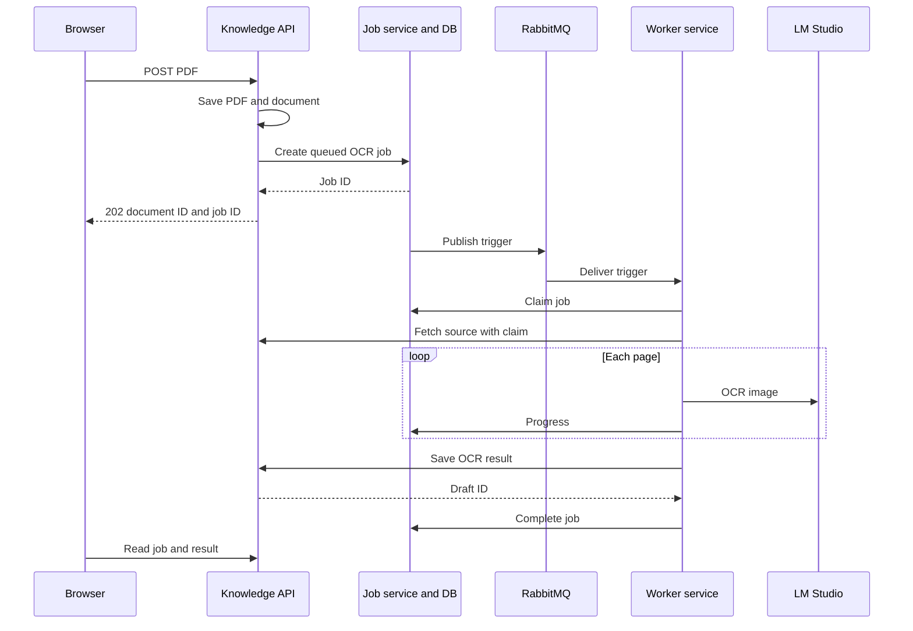

# Knowledge upload-to-OCR workflow

This is the canonical, detailed reference for the Knowledge upload-to-OCR workflow. It follows the current implementation from `POST /v1/documents` to the reviewable OCR draft. The job lifecycle is owned by job service in a separate database; Knowledge owns the PDF, document, and draft.

## One-minute explanation

Knowledge validates and stores a PDF in MinIO, creates its document row, and requests an idempotent queued OCR job from job service. It returns `202` with both IDs after the job row is durable. Job service publishes a RabbitMQ trigger. Worker service claims the job atomically, gets the PDF from a claim-checked Knowledge endpoint, runs OCR page by page through LM Studio, and reports progress. The worker sends text to Knowledge, which stores the OCR draft and moves the document to review. The worker then marks the central job completed. The UI follows status through Knowledge's existing REST and WebSocket routes.

Knowledge and job service deliberately use separate databases, so their writes cannot be one transaction. The workflow uses a stable job-creation key, conservative orphan cleanup, and idempotent result submission to make those boundaries safe.

## Public endpoints

| Purpose | Route | What to explain |
| --- | --- | --- |
| Upload PDF | `POST /v1/documents` | Multipart `file`; returns `202 {document_id, job_id}` after the job is durable |
| Read job | `GET /v1/jobs/{job_id}` | Snapshot mapped from central job service |
| Follow job | `WS /v1/ws/jobs/{job_id}` | Sequence-numbered snapshot and updates |
| Read OCR draft | `GET /v1/documents/{document_id}/result` | Draft, pages, metadata, document state |
| View original | `GET /v1/documents/{document_id}/source` | PDF stream for review |
| Edit review | `PATCH /v1/documents/{document_id}/review-draft` | Revision-checked reviewer changes |

The public router is in [router.py](../knowledge/src/app/api/v1/router.py). Read [documents.py](../knowledge/src/app/api/v1/documents.py) for upload, source, result, and review; read [jobs.py](../knowledge/src/app/api/v1/jobs.py) for the compatibility status routes.

## Code-level walkthrough: browser upload to `202`

This section is the request trace to use in a report. Names in monospace are the actual functions and methods called by the running services. Simple framework work—such as parsing multipart boundaries or serialising a response model—is not expanded unless it changes the workflow.

### 1. Browser and reverse proxy

1. The upload page calls `knowledgeClient.uploadPdf(file)` in [knowledgeClient.ts](../../../apps/admin-web/src/features/knowledge/api/knowledgeClient.ts).
   - It creates `FormData`, adds the selected PDF under the field name `file`, and sends `POST /v1/documents`.
   - It does not set the multipart `Content-Type` itself; the browser adds the boundary correctly.
   - `responseJson` reads either the JSON success body or the API's `detail` field and turns failures into `KnowledgeError` for the UI.
2. Nginx in [nginx.conf](../../../apps/admin-web/nginx.conf) receives that request at port 5173.
   - Its `/v1/` rule proxies the request unchanged to `http://knowledge-api:8000`.
   - `proxy_request_buffering off` streams the upload onward rather than buffering the whole file in nginx.
   - Its 55 MiB body limit leaves space for multipart framing; the API still enforces the real 50 MiB PDF limit.
3. FastAPI mounts the versioned router at `/v1` in [router.py](../knowledge/src/app/api/v1/router.py), then the documents router adds `/documents`. The combined route is therefore `POST /v1/documents`.

### 2. `upload_pdf`: validate and store the source

The endpoint is `upload_pdf(...)` in [documents.py](../knowledge/src/app/api/v1/documents.py). FastAPI injects four useful values: the multipart `UploadFile`, the current request, `SurrealDatabase` from `get_database`, `MinioObjectStore` from `get_object_store`, and the configured `Settings`.

| Order | Function / operation | What the code does | Why it matters |
| --- | --- | --- | --- |
| 1 | `file.read(5)` | Reads the first five bytes and requires `%PDF-`. | Rejects obvious non-PDF uploads with `415` before writing anything. This is a signature check, not a full PDF parser. |
| 2 | `file.seek(0)` then `file.read()` | Rewinds the multipart stream, reads the PDF bytes, calculates `size`, and rejects an empty body. | The first read consumed five bytes; rewinding ensures MinIO receives the whole PDF. |
| 3 | `size > settings.max_upload_bytes` | Enforces the configured 50 MiB maximum and returns `413` when exceeded. | The application limit protects the process even if nginx is bypassed. |
| 4 | `uuid4().hex` | Creates `doc_<32 hex characters>`, then derives `document:<id>` and `documents/<id>/original.pdf`. | One generated ID links the Knowledge document, the MinIO object path, and the central job's subject ID without trusting a client-supplied identifier. |
| 5 | build `document` dictionary | Prepares source metadata (`object_key`, safe basename, MIME type), `process_status="processing"`, and `status="active"`. | This is the initial Knowledge-domain record; it deliberately contains no job row because jobs now belong to job service. |
| 6 | `MinioObjectStore.put_pdf(...)` | Wraps the bytes in `BytesIO` and calls MinIO's blocking `put_object` in an AnyIO worker thread with content type `application/pdf`. | The event loop stays responsive while the PDF is stored in the private Knowledge bucket. A storage exception becomes `ObjectStoreError`, then HTTP `502 PDF storage is unavailable`. |

At this point, only the source PDF exists in MinIO. The database record and OCR job do not exist yet.

### 3. `upload_pdf`: save the Knowledge document

7. `upload_pdf` calls `SurrealDatabase.create_document(record_id, document)` in [surreal.py](../knowledge/src/app/infrastructure/surreal.py).
   - It executes `CREATE document:<record_id> CONTENT $document` against Knowledge's SurrealDB.
   - The Knowledge schema owns `document` and later `ocr_draft` records; it intentionally does not own a `job` table.
   - A database exception is wrapped as `SurrealDatabaseError`; the endpoint returns `503 Document metadata could not be saved`.
   - The PDF is intentionally retained on this `503`. A connection can fail after SurrealDB has committed, so immediate deletion could remove the source for a real document. Conservative orphan cleanup checks it after a grace period instead.

After this call succeeds, the system has a source PDF and one `document` row in `processing`; it still has no central OCR job.

### 4. `upload_pdf`: create the central OCR job

8. The endpoint calls `request.app.state.job_client.create(document_id)`. `app.state.job_client` is a `JobServiceClient`, created once by Knowledge's application lifespan in [main.py](../knowledge/src/app/main.py).
9. `JobServiceClient.create(...)` in [job_service.py](../knowledge/src/app/infrastructure/job_service.py) sends this authenticated request to job service:

   ```json
   POST /internal/v1/jobs
   {
     "owner": "knowledge",
     "type": "ocr_pdf",
     "subject_id": "document:doc_<generated-id>",
     "creation_key": "document:doc_<generated-id>"
   }
   ```

   The bearer token identifies Knowledge as the allowed owner. The `creation_key` makes this creation idempotent for that document: if a response is lost, looking up or repeating the same key returns the same job rather than creating duplicate OCR work.
10. Job service receives the call in `create_job(...)` in [job service main.py](../../job-service/src/job_service/main.py).
    - `_owner(...)` authenticates the service token for `owner="knowledge"`.
    - It confirms that `knowledge:ocr_pdf` is an enabled job type and validates the creation key.
    - It calls `JobStore.create(...)` in [store.py](../../job-service/src/job_service/store.py).
11. `JobStore.create(...)` first runs `find_creation(owner, creation_key)`.
    - If it finds a job with the same type and subject, it returns that existing job. This is the normal idempotent-retry path.
    - Otherwise it creates `job:<generated-id>` with `status="queued"`, `step="queued"`, progress zero, and sequence one in job service's separate SurrealDB.
    - If the create call itself is ambiguous or races another request, it reads by creation key again before failing. This protects the unique `(owner, creation_key)` relationship.
12. Job service returns the snapshot, including `job:<generated-id>`, to Knowledge. Knowledge returns `202 {document_id, job_id, status:"processing"}` to the browser.

If `JobServiceClient.create(...)` cannot confirm the result, `upload_pdf` returns `503 OCR job could not be created`. It intentionally keeps the processing document and PDF: the central job may exist even though Knowledge did not receive its response. Later reconciliation checks the creation key before deleting an old document with no central job.

## Code-level walkthrough: queued job to OCR result

### 5. Job publication and delivery

1. After `create_job(...)` stores the job, it schedules `JobPublisher.publish(row)` as a FastAPI background task. The HTTP `202` does not wait for RabbitMQ publication.
2. `JobPublisher.publish(...)` in [publisher.py](../../job-service/src/job_service/publisher.py) declares the durable `jobs.v1` direct exchange and the `jobs.knowledge.ocr_pdf` queue, then publishes a persistent, small JSON envelope:

   ```json
   {"version": 1, "owner": "knowledge", "type": "ocr_pdf", "job_id": "job:<generated-id>"}
   ```

   The message contains a job reference, not the PDF or OCR text. The job database remains authoritative.
3. If RabbitMQ is unavailable, the job stays `queued` in job service. `JobPublisher.run(...)` reconnects and calls `replay()`, which reads queued jobs in configured bounded batches and republishes them. There is no periodic scheduler that repeatedly scans the queue while the connection remains healthy.
4. `worker_service.main.run()` in [worker main.py](../../worker-service/src/worker_service/main.py) declares the same queue, sets `prefetch_count=1`, and gives each message to `on_message`.
5. `Envelope.decode(...)` in [core.py](../../worker-service/src/worker_service/core.py) rejects malformed, oversized, unknown-version, or wrong-type messages to the dead-letter exchange. A valid `knowledge/ocr_pdf/v1` envelope selects `KnowledgeOcrHandler`.

### 6. Claim before processing

6. `execute(...)` in [core.py](../../worker-service/src/worker_service/core.py) creates a random `claim_id` and calls job service's claim endpoint before acknowledging RabbitMQ.
7. `JobStore.claim(...)` changes the central job only when it is still `queued` and matches the expected owner/type. The successful update sets:
   - `status` to `running`;
   - `step` to `claimed`;
   - progress to 5;
   - the worker's `claim_id`; and
   - an incremented `sequence` for UI ordering.
8. Once the claim succeeds, `execute(...)` ACKs the RabbitMQ message. A duplicate message cannot win a second claim; it is acknowledged without being processed again. A temporary claim failure is NACKed for requeue.

### 7. OCR processing and progress

9. `KnowledgeOcrHandler.process(...)` in [ocr.py](../../worker-service/src/worker_service/ocr.py) calls `KnowledgeClient.source(job_id, claim_id)`.
10. Knowledge handles this at `source(...)` in [internal_jobs.py](../knowledge/src/app/api/internal_jobs.py).
    - `_worker_auth(...)` validates the worker bearer token.
    - `_claimed(...)` asks `JobServiceClient.verify(...)` whether that exact job and claim ID are active and whether its subject is a valid Knowledge document.
    - Only after both checks does Knowledge read the document row, look up its MinIO object, enforce the size limit again, and return PDF bytes. The worker never receives database or MinIO credentials.
11. Back in `KnowledgeOcrHandler.process(...)`, `_page_count(...)` opens the PDF with PDFium. The handler rejects PDFs with zero pages or more than `WORKER_OCR_MAX_PAGES`.
12. The worker sends `progress(...)` to job service at the beginning, after each page, and before saving the draft. `JobStore.progress(...)` accepts only updates from the active claim and rejects decreasing progress or page counts.
13. For every page, `_render(...)` renders it to PNG and `_extract_page(...)` sends a base64 data URL to LM Studio's OpenAI-compatible `/chat/completions` endpoint. It uses zero temperature, the configured token maximum, and one elapsed timeout per page. Invalid model output, an HTTP failure, or a timeout becomes a domain processing failure.

### 8. Persist the OCR draft and complete the job

14. When every page has text, the worker calls `KnowledgeClient.result(job_id, claim_id, pages)`. Knowledge's `result(...)` endpoint authenticates and re-verifies the claim again, then requires page numbers to be consecutive from one and under the configured maximum.
15. `DocumentMetadataDetector.detect(...)` in [document_metadata.py](../knowledge/src/app/application/document_metadata.py) derives initial reviewer-facing metadata from deterministic rules:
    - title from the first substantive OCR line, with filename fallback;
    - document type and language from text matches;
    - document number from a pattern; and
    - cohort/programme scope from the first-page heading block.

    These values are only a draft for human review, not a final classification decision.
16. `SurrealDatabase.apply_ocr_result(...)` creates `ocr_draft:<derived-id>` and updates the `document` in one Knowledge-database transaction.
    - The draft contains ordered pages, `status="draft"`, and `revision=1`.
    - The document is changed from `processing` to `review`, receives its `page_count`, and stores the detected metadata.
    - The update is guarded by `WHERE process_status = 'processing'`; repeated result delivery detects the existing draft and returns it instead of overwriting reviewer changes.
17. `KnowledgeOcrHandler.process(...)` returns the draft ID to `execute(...)`. `execute(...)` calls job service's `complete` endpoint.
18. `JobStore.finish(...)` changes only the active `running` claim to `completed`, sets progress to 100, stores the draft ID as `result_ref`, and increments `sequence`. If that response is lost, it reads the job back to detect an already-committed completion.

If the processor fails before the draft is stored, `execute(...)` calls Knowledge's `fail(...)` endpoint to move a still-processing document to `failed`, then asks job service to mark the claimed job `failed`. If the worker process itself dies after ACK, neither catch block can run; the job may remain `running`, which is a known limitation because this design has no worker lease recovery.

## Code-level walkthrough: status, review, and original PDF

- `GET /v1/jobs/{job_id}` reaches `get_job_status(...)` in [jobs.py](../knowledge/src/app/api/v1/jobs.py). It asks `JobServiceClient.get(...)` for the central snapshot, rejects non-Knowledge jobs, and maps generic fields such as `subject_id` and `result_ref` to the UI's `document_id` and `ocr_draft_id` shape.
- `WS /v1/ws/jobs/{job_id}` first validates the same job, then relays job service WebSocket events. The UI can use the increasing `sequence` to discard stale updates after reconnecting.
- `GET /v1/documents/{document_id}/result` calls `get_document_result(...)`, which loads the document and latest draft through `SurrealDatabase.get_document_result(...)`. It returns `409` until the document is in `review` and has a draft.
- `PATCH /v1/documents/{document_id}/review-draft` loads the current document/draft, requires `review` plus `draft` state, and calls `SurrealDatabase.update_document_review(...)`. That method uses the expected draft revision in a transaction; a concurrent edit produces `409` rather than overwriting someone else's corrections.
- `GET /v1/documents/{document_id}/source` resolves the object key from the document record and streams a full or single-range PDF response from MinIO. It never exposes the bucket credentials or raw object key to the browser.

## State transitions to describe in a report

The document and job state machines are separate because they are owned by different services. They are correlated by the job's `subject_id`, which is the Knowledge `document:<id>`.

| Event | Knowledge `document.process_status` | Central `job.status` | Function responsible |
| --- | --- | --- | --- |
| Upload is accepted | `processing` | `queued` | `upload_pdf` → `create_document` → `JobServiceClient.create` |
| Worker wins the claim | `processing` | `running` | `execute` → `JobStore.claim` |
| OCR pages and metadata are saved | `review` | still `running` | `KnowledgeOcrHandler.process` → Knowledge `result` → `apply_ocr_result` |
| Worker records completion | `review` | `completed` | `execute` → `JobStore.finish` |
| A caught OCR failure | `failed` | `failed` | `execute` → Knowledge `fail` → `JobStore.finish` |

The third and fourth rows are intentionally separate writes. If Knowledge saves the draft but the worker dies before job completion, the document can be in `review` while the central job remains `running`; the report should identify that as a known recovery limitation rather than data corruption.

## Source code in execution order

1. **Upload validation:** `upload_pdf` in [documents.py](../knowledge/src/app/api/v1/documents.py) checks the PDF signature and size, generates a document ID, and saves the bytes using [minio.py](../knowledge/src/app/infrastructure/minio.py).
2. **Knowledge document:** `SurrealDatabase.create_document` in [surreal.py](../knowledge/src/app/infrastructure/surreal.py) saves the source object key and `process_status=processing`. Knowledge's [schema](../knowledge/db/schema.surql) defines `document` and `ocr_draft`, not `job`.
3. **Central job creation:** [job_service.py](../knowledge/src/app/infrastructure/job_service.py) calls `POST /internal/v1/jobs` with `owner=knowledge`, `type=ocr_pdf`, `subject_id=document_id`, and a stable creation key. The owner bearer token restricts which service can create that job.
4. **Central database:** [job service main.py](../../job-service/src/job_service/main.py) authenticates and validates the request. [store.py](../../job-service/src/job_service/store.py) creates the row in the dedicated [job schema](../../job-service/db/schema.surql). The unique `(owner, creation_key)` index makes a repeated creation safe.
5. **Publish:** [publisher.py](../../job-service/src/job_service/publisher.py) sends a persistent envelope to the durable `jobs.knowledge.ocr_pdf` queue after the job is stored. It scans queued jobs in bounded batches on the first broker connection and after a reconnect. There is no periodic scan or publisher confirmation.
6. **Consume and claim:** [worker main.py](../../worker-service/src/worker_service/main.py) declares a consumer channel with prefetch one. [core.py](../../worker-service/src/worker_service/core.py) validates the exact `(owner,type,version)` envelope and asks job service to change `queued -> running` with a random claim ID. It ACKs after the claim. A duplicate trigger cannot win another claim.
7. **OCR:** [ocr.py](../../worker-service/src/worker_service/ocr.py) fetches the PDF from Knowledge, renders its pages, calls LM Studio `/chat/completions`, and posts page count and progress to job service. Each LM Studio request has a 60-second elapsed deadline; that is per page, not per document.
8. **Knowledge callbacks:** [internal_jobs.py](../knowledge/src/app/api/internal_jobs.py) authenticates the worker and asks job service to verify the active claim and subject document. It releases source bytes, accepts ordered text pages, or marks a caught failure. Knowledge's `apply_ocr_result` writes the draft and document review state. Repeating the same result returns the existing draft and does not overwrite reviewer edits.
9. **Complete:** Worker service calls the central `complete` endpoint only after Knowledge confirms its result is stored. The job stores an opaque draft reference. [jobs.py](../knowledge/src/app/api/v1/jobs.py) translates central snapshots and events into the response expected by the existing UI.

## What to understand about the data

| Data | Owner | Why |
| --- | --- | --- |
| Original PDF | Knowledge MinIO bucket | Knowledge manages source files and access |
| `document`, `ocr_draft` | Knowledge SurrealDB | Domain state and reviewer edits |
| `job` | Dedicated job-service SurrealDB | Generic lifecycle for all originating services |
| Message | RabbitMQ | Trigger only; database remains authoritative |
| OCR model output | Knowledge draft | Reviewable text, not a RabbitMQ payload |

A central job has `owner`, `type`, opaque `subject_id`, `status`, `step`, `progress`, `sequence`, optional page counts, `claim_id`, result reference, error, and timestamps. It has no Knowledge-specific `document_id` or `ocr_draft_id` columns. The public Knowledge adapter maps those generic values to the old UI shape.

The worker has neither Knowledge SurrealDB nor MinIO credentials. It can access a source PDF only through Knowledge's authenticated, claim-checked internal endpoint.

## Upload outcomes and recovery

| Situation | HTTP result | Durable state and recovery |
| --- | --- | --- |
| Valid PDF, document saved, job saved | `202` with `document_id` and `job_id` | Job service will publish now or replay the queued trigger after a broker reconnect. |
| Not a PDF | `415` | No source object, document, or job is created. |
| PDF exceeds the configured size | `413` | No source object, document, or job is created. |
| MinIO write fails | `502` | No document or job is attempted. |
| Knowledge database write cannot be confirmed | `503` | The source object is retained because the database write may have succeeded; orphan cleanup handles an old unreferenced source conservatively. |
| Job-service creation cannot be confirmed | `503` | The processing document and PDF are retained. The job request uses the document ID as a creation key, so job service can be checked safely; orphan cleanup deletes an old processing document only when no matching central job exists. |

The final `503` is intentionally not treated as a cleanup signal. A timeout can mean that job service stored the job but its response was lost. Deleting the document or PDF immediately could then strand a valid queued job.

## State and failure questions

- **Why return 202 before OCR?** OCR can take time. The endpoint waits for durable document and job writes, then responds; it does not wait for the worker or RabbitMQ confirmation.
- **Why two databases?** Job service owns shared lifecycle state; Knowledge owns domain data. These writes cannot share one transaction, so creation keys and write ordering matter.
- **Why can upload return 503 after saving the PDF?** A Knowledge or job-service write may have reached durable storage before the caller loses the response. Keeping the data lets the system reconcile safely instead of deleting a possibly valid job.
- **Broker down when uploading?** The job remains queued in the central database. Job service republishes queued jobs when it establishes or re-establishes a broker connection.
- **Duplicate message?** The `queued -> running` claim is guarded in the central database. Only one worker wins.
- **OCR timeout or caught exception?** The worker marks the Knowledge document and central job failed; no OCR retry is scheduled.
- **Worker dies after claim and ACK?** Its catch block cannot run. The central job may stay running. This design has no worker lease or automatic worker-death recovery.
- **Result stored, completion call fails?** The worker retries temporary failures while alive. If it dies, a draft can exist while the job remains running.
- **Knowledge dies before central job creation?** An old processing document without a central creation key can be detected by orphan cleanup after a grace period.
- **Why sequence numbers?** UI clients can ignore older updates after a WebSocket reconnect and fetch the REST snapshot.

## A short diagram


```mermaid
sequenceDiagram
  participant B as Browser
  participant K as Knowledge API
  participant J as Job service and DB
  participant R as RabbitMQ
  participant W as Worker service
  participant L as LM Studio
  B->>K: POST PDF
  K->>K: Save PDF and document
  K->>J: Create queued OCR job
  J-->>K: Job ID
  K-->>B: 202 document ID and job ID
  J->>R: Publish trigger
  R->>W: Deliver trigger
  W->>J: Claim job
  W->>K: Fetch source with claim
  loop Each page
    W->>L: OCR image
    W->>J: Progress
  end
  W->>K: Save OCR result
  K-->>W: Draft ID
  W->>J: Complete job
  B->>K: Read job and result
```

For local setup and endpoints, see the [Knowledge README](../knowledge/README.md). For the implementation background, see the [independent worker plan](../knowledge/plans/INDEPENDENT_WORKER_SERVICE_PLAN.md).
